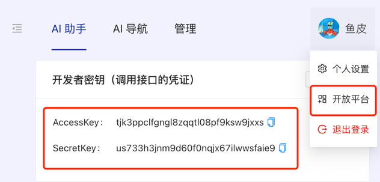

# 鱼聪明 Java SDK

基于 Spring Boot Starter 开发，只需一行代码，使用强大的 AI 能力！

鱼聪明 AI：https://yucongming.com

官方公众号：鱼聪明AI


## 快速开始

#### 0、引入 sdk

```xml
<dependency>
    <groupId>com.yucongming</groupId>
    <artifactId>yucongming-java-sdk</artifactId>
    <version>0.0.2</version>
</dependency>
```

#### 1、在 [鱼聪明 AI 开放平台](https://www.yucongming.com/dev) 获取开发者密钥对



#### 2、初始化 YuCongMingClient 对象

方法 1：自主 new 对象

```java
String accessKey = "你的 accessKey";
String secretKey = "你的 secretKey";
YuCongMingClient client = new YuCongMingClient(accessKey, secretKey);
```

方法 2：通过配置注入对象

修改配置：

```yaml
yuapi:
  client:
    access-key: 你的 access-key
    secret-key: 你的 secret-key
```

使用客户端对象：

```java
@Resource
private YuCongMingClient client;
```

#### 3、构造请求参数

```java
DevChatRequest devChatRequest = new DevChatRequest();
devChatRequest.setModelId(1651468516836098050L);
devChatRequest.setMessage("鱼皮");
```

#### 4、获取响应结果

```java
BaseResponse<DevChatResponse> response = client.doChat(devChatRequest);
System.out.println(response.getData());
```


## API 文档

### AI 对话

方法名：doChat

请求参数：

- modelId：使用的会话模型 id
- message：要发送的消息，不超过 1024 字

响应结果：

- code：响应状态码
- data： 
  - content：对话结果内容
- message：响应信息


示例代码：

```java
// 构造请求
DevChatRequest devChatRequest = new DevChatRequest();
devChatRequest.setModelId(1651468516836098050L);
devChatRequest.setMessage("鱼皮");

// 获取响应
BaseResponse<DevChatResponse> response = client.doChat(devChatRequest);
System.out.println(response.getData());
```